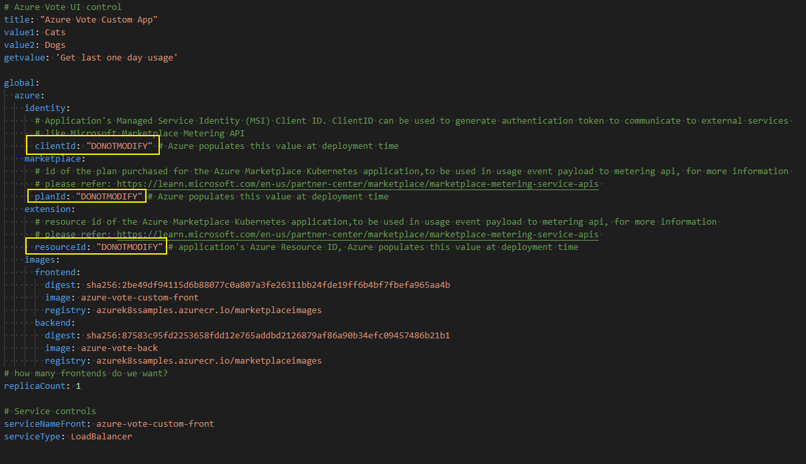

# Prepare Azure container technical assets for a Kubernetes app

This article gives technical resources and recommendations to help you create a container offer on Azure Marketplace for a Kubernetes application.

For a comprehensive example of the technical assets required for a Kubernetes app-based Container offer, see [Azure Marketplace Container offer samples for Kubernetes](https://github.com/Azure-Samples/kubernetes-offer-samples).

## Fundamental technical knowledge

Designing, building, and testing these assets takes time and requires technical knowledge of both the Azure platform and the technologies used to build the offer.

In addition to your solution domain, your engineering team should have knowledge about the following Microsoft technologies:

- Basic understanding of [Azure Services](https://azure.microsoft.com/services/)
- How to [design and architect Azure applications](https://azure.microsoft.com/solutions/architecture/)
- Working knowledge of [Azure Resource Manager](https://azure.microsoft.com/features/resource-manager/)
- Working knowledge of [JSON](https://www.json.org/)
- Working knowledge of [Helm](https://www.helm.sh)
- Working knowledge of [createUiDefinition](/azure/azure-resource-manager/managed-applications/create-uidefinition-overview)
- Working knowledge of [Azure Resource Manager (ARM) templates](/azure/azure-resource-manager/templates/overview)

## Prerequisites

- Your application must be Helm chart-based.
- All the image references and digest details must be included in the chart. No other charts or images can be downloaded at runtime.
- You must have an active publishing tenant or access to a publishing tenant and Partner Center account.
- You must have created an Azure Container Registry (ACR). You'll upload the Cloud Native Application Bundle (CNAB) to that. For more information, see [Create an Azure Container Registry](/azure/container-registry/container-registry-get-started-azure-cli).
- Install the latest version of the Azure CLI.
- The application must be deployable to Linux environment.
- The images must be scanned for [vulnerabilities](/azure/defender-for-cloud/defender-for-containers-vulnerability-assessment-azure).  
- If running the packaging tool manually, Docker needs to be installed a local machine. For more information, see the WSL 2 backend section at Docker documentation for [Windows](https://docs.docker.com/desktop/install/windows-install/) or [Linux](https://docs.docker.com/desktop/install/linux-install/). This is only supported in Linux/Windows AMD64 machines.

## Limitations

- Container Marketplace supports only Linux platform-based AMD64 images.
- Managed AKS only.
- Single containers aren't supported.
- Linked Azure Resource Manager templates aren't supported.

> [!IMPORTANT]
> The Kubernetes application-based offer experience is in preview. Preview features are available on a self-service, opt-in basis. Previews are provided "as is" and "as available," and they're excluded from the service-level agreements and limited warranty. Previews are partially covered by customer support on a best-effort basis. As such, these features aren't meant for production use.

## Publishing overview

The first step to publish your Kubernetes app-based Container offer on the Azure Marketplace is to package your application as a [Cloud Native Application Bundle (CNAB)](https://cnab.io/). This CNAB, comprised of your application’s artifacts, will be first published to your private Azure Container Registry (ACR) and later pushed to a Microsoft-owned public ACR and will be used as the single artifact you reference in Partner Center.

From there, vulnerability scanning is performed to ensure images are secure. Finally, the Kubernetes application is registered as an extension type for an Azure Kubernetes Service (AKS) cluster.

Once your offer is published, your application will leverage the [cluster extensions for AKS](/azure/aks/cluster-extensions) feature to manage your application lifecycle inside an AKS cluster.

:::image type="content" source="./media/azure-container/bundle-processing.png" alt-text="A diagram showing the three stages of bundle processing, flowing from 'Copy the bundle to a Microsoft-owned registry' to 'Vulnerability scanning' to 'Extension type registration'.":::

## Grant access to your Azure Container Registry

As part of the publishing process, Microsoft will deep copy your CNAB from your ACR to a Microsoft-owned, Azure Marketplace-specific ACR. The images are uploaded to a public registry that is accessible to all. This step requires you to grant Microsoft access to your registry. The ACR must be in the same Azure Active Directory tenant that is linked to your Partner Center account. 

Microsoft has created a first-party application responsible for handling this process with an `id` of `32597670-3e15-4def-8851-614ff48c1efa`. To begin, create a service principal based off of the application:

# [Linux](#tab/linux)

> [!NOTE]
> If your account doesn't have permission to create a service principal, `az ad sp create` will return an error message containing "Insufficient privileges to complete the operation". Contact your Azure Active Directory admin to create a service principal.

```azurecli-interactive
az login
```

Verify if a service principal already exists for the application: 
```azurecli-interactive
az ad sp show --id 32597670-3e15-4def-8851-614ff48c1efa 
```

If the command above does not return any results, create a new service principal: 

```azurecli-interactive
az ad sp create --id 32597670-3e15-4def-8851-614ff48c1efa
```

Make note of the service principal's ID to use in the following steps.

Next, obtain your registry's full ID:

```azurecli-interactive
az acr show --name <registry-name> --query "id" --output tsv
```

Your output should look similar to the following:

```bash
...
},
"id": "/subscriptions/ffffffff-ff6d-ff22-77ff-ffffffffffff/resourceGroups/myResourceGroup/providers/Microsoft.ContainerRegistry/registries/myregistry",
...
```

Next, create a role assignment to grant the service principal the ability to pull from your registry using the values you obtained earlier:

[!INCLUDE [Azure role assignment prerequisites](./includes/prerequisites-role-assignments.md)]

```azurecli-interactive
az role assignment create --assignee <sp-id> --scope <registry-id> --role acrpull
```

Finally, register the `Microsoft.PartnerCenterIngestion` resource provider on the same subscription used to create the Azure Container Registry:

```azurecli
az provider register --namespace Microsoft.PartnerCenterIngestion --subscription <subscription-id> --wait
```

Monitor the registration and confirm it has completed before proceeding:

```azurecli-interactive
az provider show -n Microsoft.PartnerCenterIngestion --subscription <subscription-id>
```

# [Windows](#tab/windows)

> [!NOTE]
> If your account doesn't have permission to create a service principal, `New-AzADServicePrincipal` will return an error message containing "Insufficient privileges to complete the operation". Contact your Azure Active Directory admin to create a service principal.

```powershell-interactive
Connect-AzAccount
```
Verify if a service principal already exists for the app ID:
```powershell-interactive
Get-AzADServicePrincipal -SearchString "Container Marketplace Package App" 
```
If the command above does not return any result, create a new service principal:

```powershell-interactive
New-AzADServicePrincipal -ApplicationId 32597670-3e15-4def-8851-614ff48c1efa
```

Obtain the service principal's ID:

```powershell-interactive
Get-AzADServicePrincipal -SearchString "Container Marketplace Package App"
```

Make note of the service principal's ID to use in the following steps.

Next, obtain your registry's full ID:

```powershell-interactive
Select-AzSubscription -SubscriptionId <subscriptionId>
Get-AzContainerRegistry -ResourceGroupName <resource-group> -Name <registry-name>
```

Your output should look similar to the following:

```bash
...
},
"id": "/subscriptions/ffffffff-ff6d-ff22-77ff-ffffffffffff/resourceGroups/myResourceGroup/providers/Microsoft.ContainerRegistry/registries/myregistry",
...
```

Next, create a role assignment to grant the service principal the ability to pull from your registry:

[!INCLUDE [Azure role assignment prerequisites](./includes/prerequisites-role-assignments.md)]

```powershell-interactive
New-AzRoleAssignment -ObjectId <sp-id> -Role acrpull -Scope <registry-id>
```

Finally, register the `Microsoft.PartnerCenterIngestion` resource provider on the same subscription used to create the Azure Container Registry:

```powershell-interactive
Connect-AzAccount
Select-AzSubscription -SubscriptionId <subscription-id>
Register-AzResourceProvider -ProviderNamespace Microsoft.PartnerCenterIngestion
```

Monitor the registration and confirm it has completed before proceeding:

```powershell-interactive
Get-AzResourceProvider -ProviderNamespace Microsoft.PartnerCenterIngestion
```


---

## Gather artifacts to meet the package format requirements

Each CNAB will be composed of the following artifacts:

- Helm chart
- CreateUiDefinition
- ARM Template
- Manifest file

### Update the Helm chart

Ensure the Helm chart adheres to the following rules:

- All image names and references are parameterized and represented in `values.yaml` as global.azure.images references. Update your Helm chart template file `deployment.yaml` to point these images. This ensures the image block can be updated to reference Azure Marketplace's ACR images.

    :::image type="content" source="./media/azure-container/image-references.png" alt-text="A screenshot of a properly formatted deployment.yaml file is shown. The parameterized image references are shown, resembling the content in the sample deployment.yaml file linked in this article.":::

- If you have any subcharts, extract the content under those charts. Then update each of your dependent image references to point to the images included in the main chart's `values.yaml`.
- Images must use digests instead of tags. This ensures CNAB building is deterministic.

    :::image type="content" source="./media/azure-container/billing-identifier.png" alt-text="A screenshot of a properly formatted values.yaml file is shown. The images are using digests. The content resembles the sample values.yaml file linked in this article.":::

### Available billing models

For all available billing models please refer to the[ licensing options for Azure Kubernetes Applications](/partner-center/marketplace/marketplace-containers). 

### Make updates based on your billing model

After reviewing the [available billing models](#available-billing-models), select one appropriate for your use case and complete the following steps:

Complete the following steps to add identifier in the *Per core*, *Per pod*, *Per node* billing models:

- Add a billing identifier label `azure-extensions-usage-release-identifier` to the Pod spec in your [workload](https://kubernetes.io/docs/concepts/workloads/) yaml files.
  - If the workload is specified as Deployments or Replicasets or Statefulsets or Daemonsets specs, add this label under **.spec.template.metadata.labels**.
  - If the workload is specified directly as Pod specs, add this label under **.metadata.labels**.

:::image type="content" source="./media/azure-container/billing-depoyment.png" alt-text="A screenshot of a properly formatted billing identifier label in a deployment.yaml file. The content resembles the sample depoyment.yaml file linked in this article.":::

:::image type="content" source="./media/azure-container/billing-statefulsets.png" alt-text="A screenshot of a properly formatted billing identifier label in a statefulsets.yaml file. The content resembles the sample statefulsets.yaml file linked in this article.":::

:::image type="content" source="./media/azure-container/billing-daemonsets.png" alt-text="A screenshot of CPU resource requests in a daemonsets.yaml file. The content resembles the sample daemonsets.yaml file linked in this article.":::

:::image type="content" source="./media/azure-container/billing-pods.png" alt-text="A screenshot of CPU resource requests in a pods.yaml file. The content resembles the sample pods.yaml file linked in this article.":::

- For *perCore* billing model, specify [CPU Request](https://kubernetes.io/docs/tasks/configure-pod-container/assign-cpu-resource/#specify-a-cpu-request-and-a-cpu-limit) by including the `resources:requests` field in the container resource manifest. This step is only required for *perCore* billing model.  

   :::image type="content" source="./media/azure-container/percorebilling.png" alt-text="A screenshot of CPU resource requests in a pods.yaml file. The content resembles the sample per core billing model file linked in this article.":::

At deployment time, the cluster extensions feature will replace the billing identifier value with the extension instance name.

For examples configured to deploy the [Azure Voting App](https://github.com/Azure-Samples/kubernetes-offer-samples/tree/main/samples/k8s-offer-azure-vote), see the following:

- [Deployment file example](https://github.com/Azure-Samples/kubernetes-offer-samples/blob/main/samples/k8s-offer-azure-vote/azure-vote/templates/deployments.yaml).

- [Values file example](https://github.com/Azure-Samples/kubernetes-offer-samples/blob/main/samples/k8s-offer-azure-vote/azure-vote/values.yaml).

For *custom meters* billing model, add the fields listed below in your helm template's values.yaml file

   - clientId should be added under global.azure.identity

   - planId key should be added under global.azure.marketplace. planId

   - resourceId should be added under global.azure.extension.resrouceId



At deployment time, the cluster extensions feature will replace these fields with the appropriate values. 

For examples configured see the [Azure Vote Custom Meters based app](https://github.com/Azure-Samples/kubernetes-offer-samples/tree/main/samples/k8s-offer-azure-vote-custom-meters). 

### Validate the Helm chart

To ensure the Helm chart is valid, test that it's installable on a local cluster. You can also use `helm install --generate-name --dry-run --debug` to detect certain template generation errors.

### Create and test the createUiDefinition

A createUiDefinition is a JSON file that defines the user interface elements for the Azure portal when deploying the application. For more information, see [CreateUiDefinition.json for Azure](/azure/azure-resource-manager/managed-applications/create-uidefinition-overview) or see an [example of a UI definition](https://github.com/Azure-Samples/kubernetes-offer-samples/blob/main/samples/k8s-offer-azure-vote/createUIDefinition.json) that asks for input data for a new or existing cluster choice and passes parameters into your application.

After creating the createUiDefinition.json file for your application, you need to test the user experience. To simplify testing, copy your file contents to the [sandbox environment](https://portal.azure.com/#view/Microsoft_Azure_CreateUIDef/SandboxBlade). The sandbox presents your user interface in the current, full-screen portal experience. The sandbox is the recommended way to preview the user interface.

### Create the Azure Resource Manager (ARM) template

An [ARM template](/azure/azure-resource-manager/templates/overview) defines the Azure resources to deploy. You'll be deploying a cluster extension resource for the Azure Marketplace application. Optionally, you can choose to deploy an AKS cluster.

We currently only allow the following resource types:

- `Microsoft.ContainerService/managedClusters`
- `Microsoft.KubernetesConfiguration/extensions`

For example, see this [sample ARM template](https://github.com/Azure-Samples/kubernetes-offer-samples/blob/main/samples/k8s-offer-azure-vote/mainTemplate.json) designed to take results from the sample UI definition linked above and pass parameters into your application.

### User parameter flow

It's important to understand how user parameters flow throughout the artifacts you're creating and packaging. In the [Azure Voting App example](), parameters are initially defined when creating the UI through a *createUiDefinition.json* file:

:::image type="content" source="./media/azure-container/user-param-ui.png" alt-text="A screenshot of the createUiDefinition example linked in this article. Definitions for 'value1' and 'value2' are shown.":::

Parameters are exported via the `outputs` section:

:::image type="content" source="./media/azure-container/user-param-ui-2.png" alt-text="A screenshot of the createUiDefinition example linked in this article. Output lines for application title, 'value1', and 'value2' are shown.":::

From there, the values are passed to the Azure Resource Manager template and will be propagated to the Helm chart during deployment:

:::image type="content" source="./media/azure-container/user-param-arm.png" alt-text="A screenshot of the Azure Resource Manager template example linked in this article. Under 'configurationSettings', the parameters for application title, 'value1', and 'value2' are shown.":::

Finally, the values are passed into the Helm chart through `values.yaml` as shown.

:::image type="content" source="./media/azure-container/user-param-helm.png" alt-text="A screenshot of the Helm chart example linked in this article. Values for application title, 'value1', and 'value2' are shown.":::

> [!NOTE]
> In this example, `extensionResourceName` is also parameterized and passed to the cluster extension resource. Similarly, other extension properties can be parameterized, such as enabling auto upgrade for minor versions. For more on cluster extension properties, see [optional parameters](/rest/api/kubernetesconfiguration/extensions/create?tabs=HTTP#request-body).

### Create the manifest file

The package manifest is a yaml file that describes the package and its contents, and tells the packaging tool where to locate the dependent artifacts.

The fields used in the manifest are as follows:

|Name|Data Type|Description|
|-|-|-|
|applicationName|String|Name of the application|
|publisher|String|Name of the Publisher|
|description|String|Short description of the package|
|version|String in `#.#.#` format|Version string that describes the application package version, may or may not match the version of the binaries inside.|
|helmChart|String|Local directory where the Helm chart can be found relative to this `manifest.yaml`|
|clusterARMTemplate|String|Local path where an ARM template that describes an AKS cluster that meets the requirements in restrictions field can be found|
|uiDefinition|String|Local path where a JSON file that describes an Azure portal Create experience can be found|
|registryServer|String|The ACR where the final CNAB bundle should be pushed|
|extensionRegistrationParameters|Collection|Specification for the extension registration parameters. Include at least `defaultScope` and as a parameter.|
|defaultScope|String|The default scope for your extension installation. Accepted values are `cluster` or `namespace`. If `cluster` scope is set, then only one extension instance is allowed per cluster. If `namespace` scope is selected, then only one instance is allowed per namespace. As a Kubernetes cluster can have multiple namespaces, multiple instances of extension can exist.|
|namespace|String|(Optional) Specify the namespace the extension will install into. This property is required when `defaultScope` is set to `cluster`. For namespace naming restrictions, see [Namespaces and DNS](https://kubernetes.io/docs/concepts/overview/working-with-objects/namespaces/#namespaces-and-dns).|

For a sample configured for the voting app, see the following [manifest file example](https://github.com/Azure-Samples/kubernetes-offer-samples/blob/main/samples/k8s-offer-azure-vote/manifest.yaml).

### Structure your application

Place the createUiDefinition, ARM template, and manifest file beside your application's Helm chart.

For an example of a properly structured directory, see [Azure Voting App example](https://github.com/Azure-Samples/kubernetes-offer-samples/tree/main/samples/k8s-offer-azure-vote).

## Use the container packaging tool

Once you've added all the required artifacts, run the packaging tool `container-package-app`.

Since CNABs are a new format and have a learning curve, we've created a Docker image for `container-package-app` with bootstrapping environment and tools required to successfully run the packaging tool.

You have two options to use the packaging tool. You can use it manually or integrate it into a deployment pipeline.

### Manually run the packaging tool

The latest image of the packaging tool can be pulled from `mcr.microsoft.com/container-package-app:latest`.

The following Docker command pulls the latest packaging tool image and also mounts a directory.

# [Linux](#tab/linux)

Assuming `~\<path-to-content>` is a directory containing the contents to be packaged, the following docker command will mount `~/<path-to-content>` to `/data` in the container. Be sure to replace `~/<path-to-content>` with your own app's location.

```bash
docker pull mcr.microsoft.com/container-package-app:latest

docker run -it -v /var/run/docker.sock:/var/run/docker.sock -v ~/<path-to-content>:/data --entrypoint "/bin/bash" mcr.microsoft.com/container-package-app:latest 
```

# [Windows](#tab/windows)

Assuming `D:\<path-to-content>` is a directory containing the contents to be packaged, the following docker command will mount `d:/<path-to-content>` to `/data` in the container. Be sure to replace `d:/<path-to-content>` with your own app's location.

```bash
docker pull mcr.microsoft.com/container-package-app:latest

docker run -it -v /var/run/docker.sock:/var/run/docker.sock -v d:/<path-to-content>:/data --entrypoint "/bin/bash" mcr.microsoft.com/container-package-app:latest 
```


---

Run the following commands in the `container-package-app` container shell. Be sure to replace `<registry-name>` with the name of your ACR:

```bash
export REGISTRY_NAME=<registry-name>

az login 

az acr login -n $REGISTRY_NAME 

cd /data/<path-to-content>
```

To authenticate the ACR, there are two options. One option is by using `az login` as shown above and the second option is through docker by running `docker login 'yourACRname'.azurecr.io`. Enter your username and password (username should be your ACR name and the password is the generated key provided in Azure portal) and run.

```bash
docker login <yourACRname.azurecr.io>
```

:::image type="content" source="./media/azure-container/docker-login.png" alt-text="Screenshot of docker login command in CLI.":::

Next, run `cpa verify` to iterate through the artifacts and validate them one by one. Address any failures, and run `cpa buildbundle` when you're ready to package and upload the CNAB to your Azure Container Registry. The `cpa buildbundle` command will also run the verification process before building

```bash
cpa verify
```

:::image type="content" source="./media/azure-container/cpa-verify.png" alt-text="Screenshot of cpa verify command in CLI.":::

```bash
cpa buildbundle 
```

> [!NOTE]
> Use `cpa buildbundle --force` only if you want to overwrite an existing tag. If you have already attach this CNAB to an Azure Marketplace offer, instead increment the version in the manifest file.

### Integrate into an Azure Pipeline

For an example of how to integrate `container-package-app` into an Azure Pipeline, see the [Azure Pipeline example](https://github.com/Azure-Samples/kubernetes-offer-samples/tree/main/samples/.pipelines/AzurePipelines/azure-pipelines.yml)

## Troubleshooting

- [Packaging Troubleshooting Help](/partner-center/marketplace/azure-container-packaging-troubleshoot)
- [Publishing Troubleshooting Help](/partner-center/marketplace/azure-container-troubleshoot)

## Next steps

- [Create your Kubernetes offer](azure-container-offer-setup.md)


