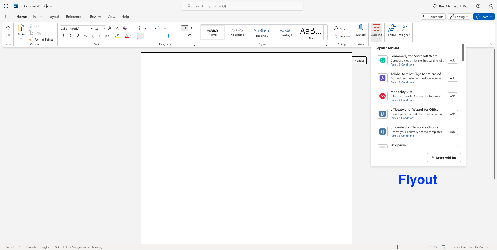
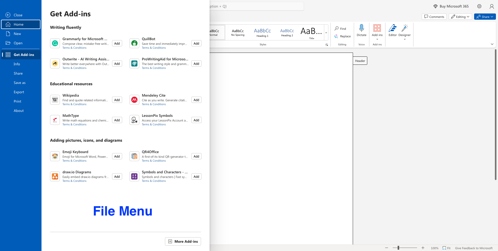

# Optimize the placement and ranking of your app in Microsoft AppSource

Do you want to deliver a top-quality add-in experience, generate positive customer reviews, and optimize your app's placement in Microsoft AppSource and within the Office experience? The depth and value that you provide in your app contributes towards your app's placement and ranking in Microsoft AppSource search results. To create a high-quality app experience, apply the [best practices for add-in development](/office/dev/add-ins/overview/add-in-development-best-practices). Make sure that customers find and use your app by [creating an effective listing](create-effective-office-store-listings.md).

## Best practices to optimize your app

Follow these best practices to optimize the end-to-end experience of your app.

|**To**|**Do this**|
|:-----|:-----|
|Get customers interested| - Use a [succinct and descriptive name](create-effective-office-store-listings.md#use-a-succinct-and-descriptive-name). - Write [compelling descriptions](create-effective-office-store-listings.md#write-compelling-descriptions) that don't rely too much on your brand. - Include informative [screenshots](craft-effective-appsource-store-images.md). - Create a [strong visual identity with your logo](create-effective-office-store-listings.md#create-a-consistent-visual-identity). - Ask customers to [rate and review your add-in](create-effective-office-store-listings.md#use-ratings-and-reviews). - Provide help and support from within your app.|
|Avoid first-run drop-off| - Offer a great [first run experience](/office/dev/add-ins/overview/add-in-development-best-practices#create-an-engaging-first-run-experience) for both new and existing customers to help customers get started quickly and easily.  - Create a [high-quality user experience](/office/dev/add-ins/overview/add-in-development-best-practices#apply-ux-design-principles). - Use [Office.js v1.1](/office/dev/add-ins/develop/update-your-javascript-api-for-office-and-manifest-schema-version) to take advantage of the latest features of the API. - [Optimize the performance](/office/dev/add-ins/overview/add-in-development-best-practices#optimize-and-monitor-add-in-performance) of your app.|
|Retain customers| - Use [add-in commands](/office/dev/add-ins/overview/add-in-development-best-practices#use-add-in-commands) to add icons to the Office ribbon so customers can easily find and use your app. - Use analytics and monitoring to understand how customers use your app. - Run A/B tests to evaluate features and functionality.|
|Drive new business|Drive traffic to your app by [linking to Microsoft AppSource](promote-your-office-store-solution.md) on your website.|

__Get Featured in the Popular Add-ins Section__

For developers of add-ins in Word, Excel, and PowerPoint, alongside their availability on AppSource and the dedicated add-in store within each application, optimization will significantly influence your positioning within the flyout and file menu. While popularity remains a pivotal factor in shaping the listing, prominence will also be accorded to the following criteria:

- Add-in Quality: Prioritizing add-ins with high-quality user experience and content, as measured by add-in rating, add-in reviews, first-run experience (FRE), free trial feature, and other related metrics. 

- User Engagement: Giving prominence to popular and well-received add-ins to facilitate easy discovery and access, based on your recent and historical data, evaluating by monthly usage, download number, admin deployment numbers, retention rate, and other related metrics.

- Security and Performance: Encouraging developers to prioritize regular updates for their add-ins, ensuring app security, optimizing performance, and enhancing the overall user experience. 

- Compliance: Add-ins should adhere to Microsoft Add-in Store policies and guidelines in order to ensure safety, privacy, and content standards are met. 

## See also

- [Make your solutions available in Microsoft AppSource and within Office](submit-to-appsource-via-partner-center.md)

