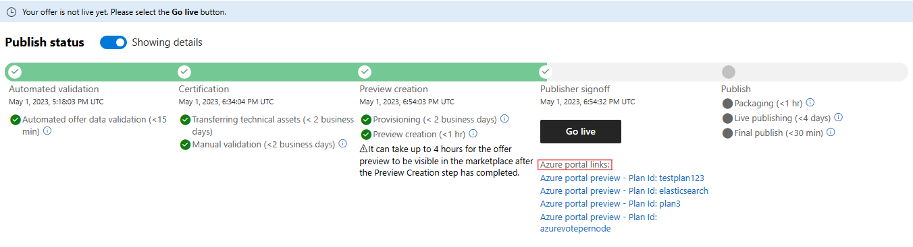

# Reference Kubernetes apps in the Azure application using a managed app sample

This article gives technical resources and recommendations to help you reference Kubernetes apps in the Azure application using a managed app sample.

## Limitations

The managed app offer won't work against an existing cluster. The offer needs to create a new cluster and install the application on the cluster, otherwise, the offer will fail to deploy.

## Prerequisites

You need to set up a Kubernetes offering in Azure Marketplace that you would like to reference in your managed app offer. You can reference to the Getting Started guide [here](https://github.com/Azure-Samples/kubernetes-offer-samples/blob/main/getting-started/GettingStarted.md) to create a Kubernetes offering.

Your UI definition and ARM template in this offer can be really simple, as you'll extend that in your managed app offer.

In this example, we start from [k8s-offer-azure-vote](https://github.com/Azure-Samples/kubernetes-offer-samples/tree/main/samples/k8s-offer-azure-vote) folder to create the CNAB bundle for the base Kubernetes offering.

Once your offer is published and available in Azure Marketplace in preview stage, you can start creating your managed app offer.



## Managed app offer

Start with the [mainTemplate](https://github.com/Azure-Samples/kubernetes-offer-samples/blob/main/samples/managed-app-sample/mainTemplate.json) and [createUIDefinition](https://github.com/Azure-Samples/kubernetes-offer-samples/blob/main/samples/managed-app-sample/createUiDefinition.json) files in this folder. 

First, update the variables section:

```json
"variables": {
    "plan-name": "DONOTMODIFY",
    "plan-publisher": "DONOTMODIFY",
    "plan-offerID": "DONOTMODIFY",
    "releaseTrain": "DONOTMODIFY",
    "clusterExtensionTypeName": "DONOTMODIFY"
},
```
To retrieve the value directly from the Kubernetes offering, follow this [guide](/azure/aks/deploy-application-template).

## Prepare mainTemplate.json

In this sample [mainTemplate](https://github.com/Azure-Samples/kubernetes-offer-samples/blob/main/samples/managed-app-sample/mainTemplate.json), we have added extra components to demonstrate how to add more components to the managed app offer. 

*User-assigned identity*:

```json
{
    "type": "Microsoft.ManagedIdentity/userAssignedIdentities",
    "name": "[concat(parameters('clusterResourceName'), '-identity')]",
    "apiVersion": "2023-01-31",
    "location": "[resourceGroup().location]"
},
```

- Keyvault, access policy and secret:

```json
{
    "name": "[uniqueString(resourceGroup().id, resourceGroup().location, 'keyvault')]",
    "type": "Microsoft.KeyVault/vaults",
    "apiVersion": "2019-09-01",
    "location": "[resourceGroup().location]",
    "tags": {
        "displayName": "keyVault1"
    },
    "properties": {
        "enabledForDeployment": true,
        "enabledForTemplateDeployment": true,
        "enabledForDiskEncryption": true,
        "tenantId": "[subscription().tenantId]",
        "accessPolicies": [
            {
                "tenantId": "[subscription().tenantId]",
                "objectId": "[reference(resourceId('Microsoft.ManagedIdentity/userAssignedIdentities', concat(parameters('clusterResourceName'), '-identity')), '2023-01-31').principalId]",
                "permissions": {
                    "keys": [
                        "Get"
                    ],
                    "secrets": [
                        "List",
                        "Get",
                        "Set"
                    ]
                }
            }
        ],
        "sku": {
            "name": "standard",
            "family": "A"
        }
    },
    "resources": [
        {
            "type": "secrets",
            "name": "secretExample1",
            "apiVersion": "2016-10-01",
            "dependsOn": [
                "[resourceId('Microsoft.KeyVault/vaults', uniqueString(resourceGroup().id, resourceGroup().location, 'keyvault'))]"
            ],
            "properties": {
                "value": "secretValue"
            }
        }
    ],
    "dependsOn": [
        "[resourceId('Microsoft.ManagedIdentity/userAssignedIdentities', concat(parameters('clusterResourceName'), '-identity'))]"
    ]
}
```

- Assigning the identity to the cluster's node and depends on:

```json
"type": "Microsoft.ContainerService/managedClusters",
"apiVersion": "2022-11-01",
"name": "[parameters('clusterResourceName')]",
"location": "[parameters('location')]",
"dependsOn": [
    "[resourceId('Microsoft.ManagedIdentity/userAssignedIdentities', concat(parameters('clusterResourceName'), '-identity'))]"
],
"tags": {},
"sku": {
    "name": "Basic",
    "tier": "Free"
},
"identity": {
    "type": "UserAssigned",
    "userAssignedIdentities": {
        "[resourceId('Microsoft.ManagedIdentity/userAssignedIdentities', concat(parameters('clusterResourceName'), '-identity'))]": {}
    }
},
```

### UIDefinition

In this sample [createUiDefinition](https://github.com/Azure-Samples/kubernetes-offer-samples/blob/main/samples/managed-app-sample/createUiDefinition.json), we have removed extra components that aren't applicable for the managed app offer.

## Package the files

Add the two files `mainTemplate.json` and `createUiDefinition.json` to a zip file. 

## Create the managed app offer

Now that you have the artifacts required, you can follow this [guide](azure-app-offer-setup.md) to create the managed app offer.
