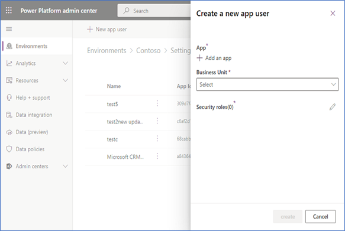
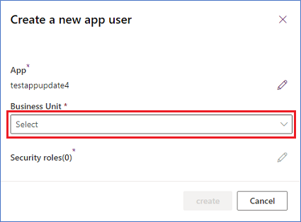
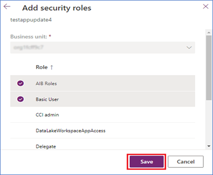

# Set up an Azure Marketplace subscription for hosted test drives

This article explains how to set up an Azure Marketplace subscription and **Dynamics 365 apps on Dataverse and Power Apps** or **Dynamics 365 Operations Apps** environment for test drives.

[!INCLUDE [Important - Azure AD Graph is deprecated](../developer/includes/azure-ad-graph-notice.md)]

## Set up for Dynamics 365 apps on Dataverse and Power Apps

1. Sign in to the [Azure portal](https://portal.azure.com/) with an Admin account.
1. Verify you are in the tenant associated with your Dynamics 365 test drive instance by hovering over your account icon in the upper right corner. If you are not in the correct tenant, select the account icon to switch into the correct tenant.

    :::image type="content" source="./media/test-drive/select-correct-tenant.png" alt-text="Screenshot showing how to select the correct tenant.":::

1. Verify that the **Dynamics 365 Customer Engagement Plan** license is available.

    :::image type="content" source="media/test-drive/check-plan-license.png" alt-text="Screenshot showing how to check the plan license." lightbox="media/test-drive/check-plan-license.png":::

1. Create an Azure Active Directory (AD) app in Azure. AppSource will use this app to provision and deprovision the test drive user in your tenant.
    1. From the filter pane, select **Azure Active Directory**.
    1. Select **App registrations**.

        :::image type="content" source="media/test-drive/app-registrations.png" alt-text="Screenshot showing how to select app registrations." lightbox="media/test-drive/app-registrations.png":::

    1. Select **New registration**.
    1. Provide an appropriate application name.

        :::image type="content" source="./media/test-drive/register-an-application.png" alt-text="Screenshot showing how to register an application.":::

    1. Under Supported account types, select **Account in any organization directory and personal Microsoft accounts**.
    1. Select **Create** and wait for your app to be created.
    1. Once the app is created, note the **Application ID** displayed on the overview screen. You will need this value later when configuring your test drive.
    1. Under **Manage Application**, select **API permissions**.
    1. Select **Add a permission** and then **Microsoft Graph API**.
    1. Select the **Application** permission category and then the **User.ReadWrite.All**, **Directory.Read.All** and **Directory.ReadWrite.All** permissions.

        :::image type="content" source="./media/test-drive/microsoft-graph.png" alt-text="Screenshot showing how to set the application permissions.":::

    1. Once the permission is added, select **Grant admin consent for Microsoft**.
    1. From the message alert, select **Yes**.

        :::image type="content" source="media/test-drive/api-permissions-confirmation-customer.png" alt-text="Screenshot showing the application permissions are successfully granted." lightbox="media/test-drive/api-permissions-confirmation-customer.png":::

    1. To generate a secret for the Azure AD App:
        1. From **Manage Application**, select **Certificate and secrets**.
        1. Under Client secrets, select **New client secret**.

             :::image type="content" source="./media/test-drive/new-client-secret.png" alt-text="Screenshot showing how to add a new client secret.":::

        1. Enter a description, such as *Test Drive*, and select an appropriate duration. Because the test drive will break once this Key expires, at which point you will need to generate and provide AppSource a new key, we recommend using the maximum duration of 24 months.
        1. Select **Add** to generate the Azure app secret. Copy this value as it will be hidden as soon as you leave this blade. You will need this value later when configuring your test drive.

            :::image type="content" source="./media/test-drive/add-client-secret-customer.png" alt-text="Screenshot showing how to add a client secret.":::

1. Add the Service Principal role to the application to allow the Azure AD app to remove users from your Azure tenant. There are two options for completing this step.

    **Option 1**

    1. Search for **Azure AD roles and administrators** and select the service.

        :::image type="content" source="./media/test-drive/active-ad-roles.png" alt-text="Screenshot showing how to search for Azure AD roles and administrators.":::

    1. On the **All roles** page, search for the **User Administrator** role and double-click **User administrator**.

        :::image type="content" source="./media/test-drive/user-administrator.png" alt-text="Screenshot showing how to search for and select User administrator.":::

    1. Select **Add Assignments**.

        :::image type="content" source="./media/test-drive/add-assignments-1.png" alt-text="Screenshot showing the add assignments button.":::

    1. Search for and select the above-created app, then **Add**.

        :::image type="content" source="./media/test-drive/add-assignments-2.png" alt-text="Screenshot showing a successful app assignment.":::

    1. Note the Service Principal role successfully assigned to the application:

        :::image type="content" source="./media/test-drive/successful-assignment.png" alt-text="Screenshot showing the Service Principal role successfully assigned to the application.":::

    **Option 2**

    1. Open an Administrative-level PowerShell command prompt.
    1. Install-Module MSOnline (run this command if MSOnline is not installed).
    1. Connect-MsolService (this will display a popup window; sign in with the newly created org tenant).
    1. $applicationId = **<YOUR_APPLICATION_ID>**.
    1. $sp = Get-MsolServicePrincipal -AppPrincipalId $applicationId.
    1. Add-MsolRoleMember -RoleObjectId fe930be7-5e62-47db-91af-98c3a49a38b1 -RoleMemberObjectId $sp.ObjectId -RoleMemberType servicePrincipal.

         :::image type="content" source="./media/test-drive/sign-in-to-account.png" alt-text="Screenshot showing how to sign in to your account.":::

1. Create a new Security Group and add it to Canvas App (Power Apps). This step is only applicable to Dynamics 365 for Customer Engagement & Power Apps offers with the Canvas Apps option.
    1. Create a new Security Group.
        1. Go to **Azure Active Directory**.
        1. Under **Manage**, select **Groups**.
        1. Select **+ New Group**.
        1. Select the **Security Group** type. 
        1. For **Group Name**, enter *TestDriveSecurityGroup*.
        1. Add a description, such as **Security Group for Test Drive**.
        1. Leave other fields as default and select **Create**.

            :::image type="content" source="./media/test-drive/create-new-group.png" alt-text="Screenshot showing how to create a new security group.":::

    1. Add the security group just created to the Canvas App (Power Apps).
        1. Open the **PowerApps** portal page and sign in.
        1. Select **Apps**, then the ellipses at the app.
        1. Select **Share**.
        1. Search for the **TestDriveSecurityGroup** security group created in the prior step.
        1. Add **Data permissions** to the security group.
        1. Clear the **send email** invitation check box.
        1. Select **Share**.
    
            > [!NOTE]
            > When using a backend data source other than CE/Dataverse for Canvas App (Power Apps):
            > - Allow the above created security group to access your data source. For example, a SharePoint data source.
            > - Open SharePoint and share the data table with the Security Group.

1. Add the just-created Azure app as an application user to your test drive CRM instance. This step is applicable only to Dynamics 365 apps on Dataverse and Power Apps Offers.
    1. Sign in to the **Power Platform admin center** as a **System Administrator**.
    1. Select **Environments**, and then select an environment from the list.
    1. Select **Settings**.
    1. Select **Users + permissions**, and then select **Application users**.
    1. Select **+ New app user** to open the **Create a new app** user page.       
              
    
    1. Select **+ Add an app** to choose the registered **Azure AD** application that was created for the selected user, and then select **Add**.
       
       > [!NOTE]
       > In addition to entering the Application Name or Application ID, you can also enter an Azure Managed Identity Application ID. For Managed Identity, do not enter the Managed Identity Application Name, use the Managed Identity Application ID instead.
       
    1. The selected **Azure AD app** is displayed under **App**. You can select **Edit (**:::image type="icon" source="media/test-drive/pencil-image-test-drive.png":::**)** to choose another Azure AD application. Under **Business Unit**, select a business unit from the dropdown list.
        
        
        
    1. After choosing a **business unit**, you can select   for **Security roles** to choose security roles for the chosen business unit to add to the new application user. After adding security roles, select **Save**.
        
        
          
    1. Select **Create**.
    5. Select **Manage roles**.  
    1. Assign a custom or OOB security role that contains read, write, and assign role privileges, such as *System Administrator*.

        :::image type="content" source="./media/test-drive/security-roles-selection.png" alt-text="Screenshot showing how to select the role privileges.":::
        
    1. Enable the **Act on Behalf of Another User** privilege.
    1. Assign the application user the custom security role you created for your test drive.
       
## Set up for  Dynamics 365 Operations Apps

1. Sign into the [Azure portal](https://portal.azure.com/) with an Admin account.
1. Verify you are in the tenant associated with your Dynamics 365 test drive instance by hovering over your account icon in the upper right corner. If you are not in the correct tenant, select the account icon to switch into the correct tenant.

    :::image type="content" source="./media/test-drive/select-correct-tenant.png" alt-text="Screenshot showing how to select the correct tenant.":::

1. Create an Azure AD App in Azure. AppSource will use this app to provision and deprovision the test drive user in your tenant.
    1. From the filter pane, select **Azure Active Directory**.
    1. Select **App registrations**.

        :::image type="content" source="./media/test-drive/app-registrations.png" alt-text="Screenshot showing how to select an app registration.":::

    1. Select **New registration**.
    1. Provide an appropriate application name.

        :::image type="content" source="./media/test-drive/register-an-application.png" alt-text="Screenshot showing how to register an application.":::

    1. Under Supported account types, select **Account in any organization directory and personal Microsoft accounts**.
    1. Select **Create** and wait for your app to be created.
    1. Once the app is created, note the **Application ID** displayed on the overview screen. You will need this value later when configuring your test drive.
    1. Under **Manage Application**, select **API permissions**.
    1. Select **Add a permission** and then **Microsoft Graph API**.
    1. Select the **Application** permission category and then the **Directory.Read.All** and **Directory.ReadWrite.All** permissions.

       :::image type="content" source="./media/test-drive/microsoft-graph.png" alt-text="Screenshot illustrating how to set application permissions.":::

    1. Select **Add permission**.
    1. Once the permission is added, select **Grant admin consent for Microsoft**.
    1. From the message alert, select **Yes**.

        :::image type="content" source="media/test-drive/api-permissions-confirmation-operations.png" alt-text="Screenshot showing the application permissions successfully granted." lightbox="media/test-drive/api-permissions-confirmation-operations.png":::

    1. To generate a secret for the Azure AD App:
        1. From **Manage Application**, select **Certificate and secrets**.
        1. Under Client secrets, select **New client secret**.
        1. Enter a description, such as *Test Drive*, and select an appropriate duration. The test drive will break once this Key expires, at which point you will need to generate and provide AppSource a new key.
        1. Select **Add** to generate the Azure app secret. Copy this value as it will be hidden as soon as you leave this blade. You will need this value later when configuring your test drive.

            :::image type="content" source="./media/test-drive/add-client-secret-operations.png" alt-text="Screenshot showing the addition of a client secret.":::

1. Add the Service Principal role to the application to allow the Azure AD app to remove users from your Azure tenant.
    1. Open an Administrative-level PowerShell command prompt.
    1. Install-Module MSOnline (run this command if MSOnline is not installed).
    1. Connect-MsolService (this will display a popup window; sign in with the newly created org tenant).
    1. $applicationId = **<YOUR_APPLICATION_ID>**.
    1. $sp = Get-MsolServicePrincipal -AppPrincipalId $applicationId.
    1. Add-MsolRoleMember -RoleObjectId fe930be7-5e62-47db-91af-98c3a49a38b1 -RoleMemberObjectId $sp.ObjectId -RoleMemberType servicePrincipal.

        :::image type="content" source="./media/test-drive/sign-in-to-account.png" alt-text="Screenshot showing how to sign in to an account.":::

1. Now add the above app to **Dynamics 365 Operations Apps** to enable the app to manage users.
    1. Find your **Dynamics 365 Operations Apps** instance.
    1. From the top-left corner, select the three-line icon (☰).
    1. Select **System Administration**.
    1. Select **Azure Active Directory applications**.
    1. Select **+ New**.
    1. Enter the **Client ID of the Azure AD app** that is going to perform the on-behalf-of actions.

    > [!NOTE]
    > The user ID on whose behalf the actions will be performed (typically the System Admin of the instance or a user who has privileges to add other users).

    :::image type="content" source="media/test-drive/system-admin-user-id.png#lightbox" alt-text="Screenshot showing the user ID on whose behalf the actions will be performed (typically the System Admin of the instance or a user who has privileges to add other users).](media/test-drive/system-admin-user-id.png)":::

## Next steps

- [Commercial marketplace partner and customer usage attribution](azure-partner-customer-usage-attribution.md)
