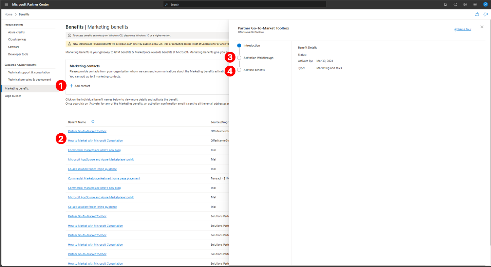

# Go-To-Market benefits

**Appropriate roles**: Global admin | MPN Partner Admin

Marketing benefits is your gateway to GTM benefits & Marketplace rewards benefits at Microsoft. Marketing benefits give you access to exclusive sales and marketing resources that can help you accelerate your time to market, generate leads, and expand your business. This article describes the marketing benefits that are available to partners and how to activate them. To look at specific marketing benefits you receive, refer to respective membership pages. [Learn more](/partner-center/mpn-overview) about membership. 

## View marketing benefits in Partner Center

To view your Marketing benefits, sign in [Partner Center Marketing Benefits Page](https://partner.microsoft.com/dashboard/v2/benefits/marketing). You see a list of Marketing offers that are either already redeemed or that are yet to be redeemed.

## Redeem your marketing benefits

Before you activate these benefits, you must assign atleast one (maximum of three) marketing person. This contact receives follow-up communications and emails about your benefit. To add or update your marketing contact information, you should click on **Add contact** and complete the addition of the user. In case you're unable to find a user, you need to create a user. [Learn more](/partner-center/create-user-accounts-and-set-permissions) about how to create user. 

After you update your marketing contact, click on marketing offer you want to redeem. A right side panel opens, look for instructions in **Activation Walkthrough** step and proceed with redeeming the benefits from **Activate Benefits** step.

## Next steps

- [Benefits Overview](/partner-center/manage-your-partner-network-benefits)
- [Benefits FAQs](/partner-center/benefits-faq-new)
- [Membership Overview](/partner-center/mpn-overview)

